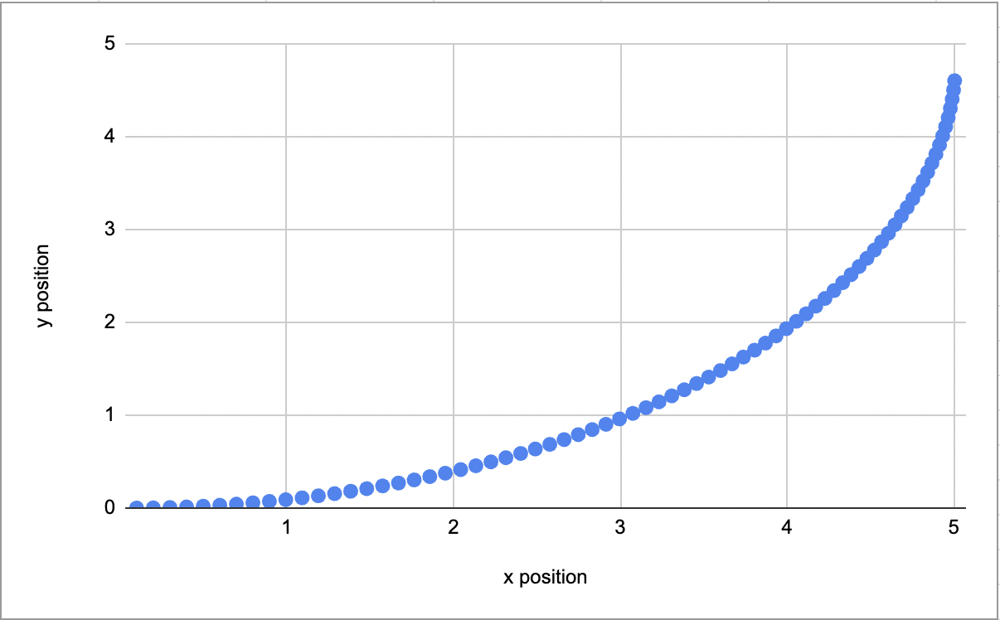

# Lightweight Autonomous Vehicle Simulator (C++17)

## Summary
This project implements a lightweight simulation engine for AV-style actors in 2D.
The core focus is on geometric modeling, actor dynamics, and a clean architecture that can later support planning, controls, and visualization.

The simulator updates a collection of dynamic and static actors (vehicles, obstacles, lanes) over discrete time steps, applying simple kinematics and producing world-frame geometry for collision and rendering.

### Current Features
* Actor System
    * Base Actor class with position, velocity, yaw, and unique polygon geometry.
    * World-frame polygon computation using rotation and translation.
    * Support for static actors (lanes, obstacles) and dynamic actors (vehicles).
* Polygon & Geometry Utilities
    * Vector2D for basic geometry ops
    * Polygon for local-frame vertices, rotation, and world-frame transforms
* Simulator Core
    * Time-stepped simulator
    * Kinematic updates for all dynamic actors
* Map Container
    * Read-only registry of all actors for future UI/frontend consumption

## Project Goals

I'm making this project to practice C++ within AV context. I'm emphasizing writing clean, modular code where I can build more features on top of while maintaining a focused scope (estimating 6 weeks to complete)

## Build Instructions
### Prerequisites

* CMake ≥ 3.16

* C++17

### Build
```
cd sim
mkdir build
cd build
cmake ..
make -j
```

### Execute
```./sim_runner```

### Sample Output
```
Mac:build liamgreubel$ ./sim_runner 
Vehicle1 at (0, 0)
----positions at time = 0----
Vehicle1 at (0.1, 0)
----positions at time = 0.1----
Vehicle1 at (0.19998, 0.00199987)
----positions at time = 0.2----
.
.
.
Vehicle1 at (5.00512, 4.6048)
----positions at time = 9.7----
Vehicle1 at (5.00512, 4.6048)
----positions at time = 9.8----
Vehicle1 at (5.00512, 4.6048)
----positions at time = 9.9----
```



### High-Level Architecture
#### Core Modules Currently Implemented

* Actor: pose + velocity + polygon

* Polygon: local geometry and world-frame transforms

* Map: read-only view of all actors

* Simulator: owns actors, updates them, and steps simulation forward

* Collision Detection

* Polygon intersection and bounding-box prechecks

* Vehicle Motion Model (bicycle model)

* Pure pursuit or waypoint-tracking controller (in progress)

#### Roadmap (Future planned work not yet implemented)

* Map & Lane Loading from JSON

* Frontend Visualization

* Minimal web-based 2D renderer

* Python Bindings
